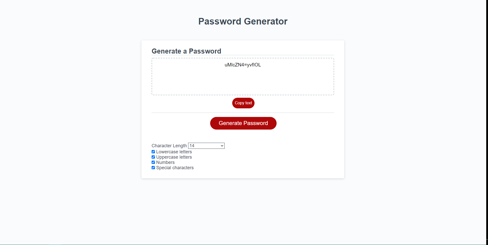

# password-generator

## Table of Contents

* [Description](#description)
* [Usage](#usage)
* [Credit](#credit)
* [Questions](#questions)
* [License](#license)

## Description

This password generator is a refactored version of a previous project I worked on while I was in the UNCC bootcamp. In addition to updating the code to reflect my new found knowledge and best practices, I added additional functionality such as check boxes rather than prompts, a dropdown menu, and a copy button.

A random string will be populated inside of the textbox based off of the criteria you set. You can control the length of the password (between 8 and 128 characters) and what characters to include (lowercase letters, uppercase letters, numbers, and special characters). The password is guaranteed to include all of the characters that you selected. The longer the password and the more character types, the more secure it will be. According to Wired, you want your password to be between 12-15 characters, with varied characters, and make sure you don't use it for more than one account.

## Usage

Repo: https://github.com/ngkent75/password-generator

Deployment: https://ngkent75.github.io/password-generator/

1. Use the dropdown menu to choose how long you want your password to be. Your options are between 8 and 128 characters. For a secure password, at least 12 characters is recommended.

2. Check off the checkboxes to choose what characters you want included. The more characters, the more secure the password will be.

3. Click the generate password button, and a password following all the criteria you set will populate inside the dotted box.

4. Click the copy button, and the password will be saved to your clipboard, and you can paste it wherever you like.

## Credit

Markdown documentation: https://guides.github.com/features/mastering-markdown/#syntax

Wired article about password security: https://www.wired.com/2016/05/password-tips-experts/

VSCode: https://code.visualstudio.com/

## Questions

Have any questions? Feel free to reach out.

GitHub: [ngkent75](https://github.com/ngkent75)

Email: [ngkent75@gmail.com](mailto:ngkent75@gmail.com)

## License

MIT License

Copyright (c) 2021 Nathaniel Kent

Permission is hereby granted, free of charge, to any person obtaining a copy
of this software and associated documentation files (the "Software"), to deal
in the Software without restriction, including without limitation the rights
to use, copy, modify, merge, publish, distribute, sublicense, and/or sell
copies of the Software, and to permit persons to whom the Software is
furnished to do so, subject to the following conditions:

The above copyright notice and this permission notice shall be included in all
copies or substantial portions of the Software.

THE SOFTWARE IS PROVIDED "AS IS", WITHOUT WARRANTY OF ANY KIND, EXPRESS OR
IMPLIED, INCLUDING BUT NOT LIMITED TO THE WARRANTIES OF MERCHANTABILITY,
FITNESS FOR A PARTICULAR PURPOSE AND NONINFRINGEMENT. IN NO EVENT SHALL THE
AUTHORS OR COPYRIGHT HOLDERS BE LIABLE FOR ANY CLAIM, DAMAGES OR OTHER
LIABILITY, WHETHER IN AN ACTION OF CONTRACT, TORT OR OTHERWISE, ARISING FROM,
OUT OF OR IN CONNECTION WITH THE SOFTWARE OR THE USE OR OTHER DEALINGS IN THE
SOFTWARE.